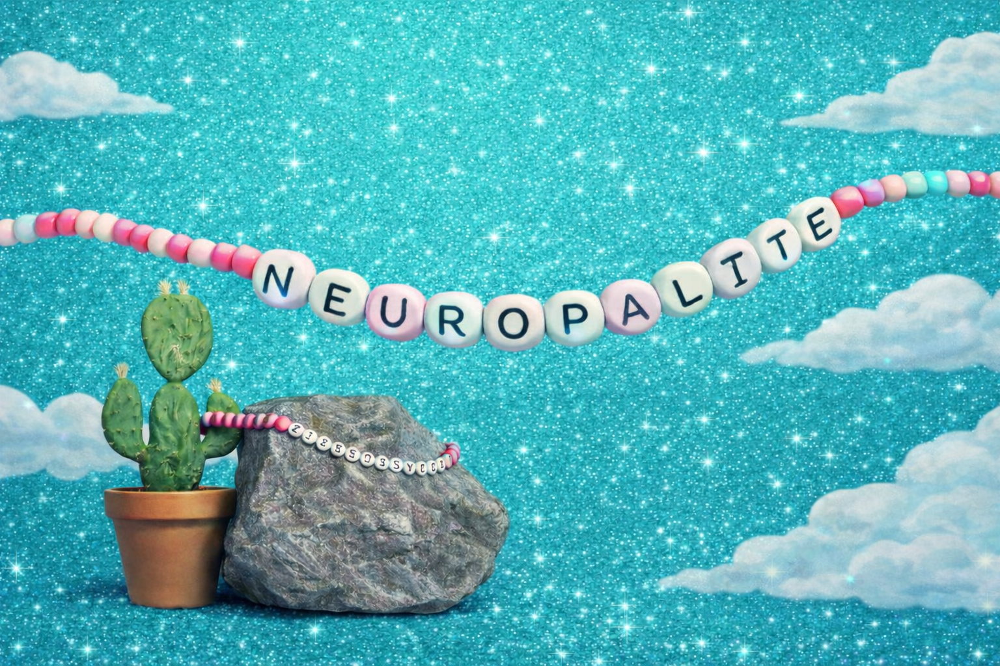

# Neuropalite



A real-time **dyadic neurofeedback** application built in Unity 6 (URP). Two participants wear EEG headsets, and their alpha power (8–12 Hz) is streamed via [Lab Streaming Layer (LSL)](https://labstreaminglayer.org/) to animate two dancing characters on stage — set to Taylor Swift's *Opalite* (BPM 125).

When alpha is low, the characters look sad and idle. As alpha rises, they dance with increasing energy. When both participants synchronize — high alpha and close together — center-stage fireworks explode.

Built as a **science outreach** tool to make neuroscience tangible and fun.

---

## How It Works

### Scenes

| Scene | Description |
|-------|-------------|
| **StartOpalite** | Landing screen with LSL connection status indicators and a Start button |
| **RunOpalite** | Main experience — music, dancing, lights, fireworks. Auto-returns to Start when the song ends |

### Alpha → Animation Mapping

Each participant's alpha power (0–1) drives their character independently:

| Alpha Range | Dance Tier | Facial Expression |
|-------------|-----------|-------------------|
| 0.0 – 0.3 | Idle | Sad (100% → 0%) |
| 0.3 – 0.5 | Low energy (Dance 1–2) | Happy (0% → 50%) |
| 0.5 – 0.7 | Medium energy (Dance 3–5) | Happy (50% → 100%) |
| 0.7 – 1.0 | High energy (Dance 6–7) | Happy (100%) |

Animations play to completion before switching tiers — no mid-clip cuts.

### Fireworks (VFX Graph)

| Condition | Firework | Behavior |
|-----------|----------|----------|
| P1 alpha > P2 alpha | Left | Fires rockets — frequency scales with dominance |
| P2 alpha > P1 alpha | Right | Mirror of left |
| Both > 0.5 AND close together | Center | Frequency and explosion size scale with synchrony |

Controlled via the VFX Graph's exposed `Launch delay` and `Explosion particles` properties.

### Nightclub Lights

Seven SpaceZeta spotlight models rotate in true circles over the stage. Each has a fixed color from a vibrant palette. Programmatically created Unity Spot Lights project colored light onto the floor. Emission pulses on the beat.

### Sync Indicators

Two floating indicators (left and right) move vertically with each participant's alpha, providing a simple visual readout of the current brain state.

---

## LSL Configuration

The app expects **2 LSL streams**, each with 1 channel (float):

| Stream Name | Channel | Description |
|-------------|---------|-------------|
| `AlphaPower_P1` | 1 float | Participant 1 alpha power (0–1) |
| `AlphaPower_P2` | 1 float | Participant 2 alpha power (0–1) |

Stream names are configurable in the Inspector on the `LSLManager` GameObject.

### Mock LSL Sender (for testing)

```bash
pip install pylsl numpy
python Tests/python_mock_lsl_sender.py
```

Sends two sine-wave alpha streams at 10 Hz for testing without EEG hardware.

---

## LSL4Unity Fix for Unity 6 + macOS (Apple Silicon)

> **This is critical.** LSL4Unity bundles liblsl 1.16.0 which fails to discover streams on Unity 6 + macOS Apple Silicon. Stream resolution returns 0 results even though streams are visible from Python.

### Fix: Replace with liblsl 1.17+

1. **Get a newer liblsl** from pylsl (which bundles 1.17.4+):
   ```bash
   pip install pylsl
   PYLSL_LIB=$(python -c "import pylsl; print(pylsl.lib.__file__)")
   ```

2. **Extract the arm64 slice** (pylsl ships a universal binary):
   ```bash
   lipo "$PYLSL_LIB" -thin arm64 -output /tmp/liblsl_arm64.dylib
   ```

3. **Fix the install name** (Unity requires a specific rpath):
   ```bash
   install_name_tool -id "@rpath/liblsl.2.dylib" /tmp/liblsl_arm64.dylib
   ```

4. **Re-sign** (required on macOS):
   ```bash
   codesign --force --sign - /tmp/liblsl_arm64.dylib
   ```

5. **Copy to all 3 dylib files** in the LSL4Unity plugin folder:
   ```bash
   PLUGIN_DIR="Packages/com.labstreaminglayer.lsl4unity/Plugins/LSL/macOS/arm64"
   cp /tmp/liblsl_arm64.dylib "$PLUGIN_DIR/liblsl.2.1.0.dylib"
   cp /tmp/liblsl_arm64.dylib "$PLUGIN_DIR/liblsl.2.dylib"
   cp /tmp/liblsl_arm64.dylib "$PLUGIN_DIR/liblsl.dylib"
   ```

6. **Restart Unity** — streams should now be discovered.

---

## Project Structure

```
Assets/
├── Scripts/
│   ├── LSL/                 # LSLManager, AlphaPowerReceiver, StreamStatus
│   ├── Animation/           # DanceAnimationController, AlphaAnimationDriver
│   ├── Audio/               # MusicController, BeatSync
│   ├── Effects/             # ClubLightController, FireworkController, SyncIndicator, SceneTransition
│   └── UI/                  # StartSceneUI, StreamStatusIndicator
├── Scenes/
│   ├── StartOpalite.unity
│   └── RunOpalite.unity
├── Art/                     # Textures, shaders, materials, models
├── Audio/Music/             # Opalite.mp3
├── Animations/              # Mixamo dance clips + Animator Controllers
└── Settings/                # URP render pipeline assets
Tests/
└── python_mock_lsl_sender.py
```

---

## Key Inspector Parameters

### LSLManager (DontDestroyOnLoad singleton)
- **Stream Names**: `AlphaPower_P1`, `AlphaPower_P2` (configurable)
- **Data Timeout**: 2.0s — after this delay without data, status goes from Receiving → Connected

### AlphaAnimationDriver (per character)
- **Participant Index**: 0 or 1
- **Smoothing Factor**: 0.9 (exponential moving average, 0 = raw, 0.99 = very smooth)
- **Face Mesh**: SkinnedMeshRenderer with blendshapes (index 11 = sad, 14 = happy)

### DanceAnimationController (per character)
- **Tier Thresholds**: 0.3 / 0.5 / 0.7
- **Min Loops Before Switch**: 2 (prevents too-frequent animation changes)
- **Crossfade Duration**: 0.8s

### FireworkController
- **Dominance Threshold**: 0.05 (minimum alpha difference to trigger side fireworks)
- **Launch Delay**: 3.0s (slow) → 0.5s (fast) for sides, 2.0s → 0.3s for center
- **Explosion Particles**: 200 (min) → 1000 (max)

### ClubLightController
- **Spot Intensity**: 20 (needs to be high for visible floor projection)
- **Rotation Speed**: 25 (degrees/sec base, varies per light)
- **Rotation Range**: 35 (max tilt from vertical)

---

## Requirements

- **Unity 6** (6000.x) with **Universal Render Pipeline 17.x**
- **VFX Graph** package (for fireworks)
- **LSL4Unity** (via UPM — see fix above for macOS)
- Python 3.8+ with `pylsl` and `numpy` (for mock sender)

---

## Assets & Credits

### Music
- *Opalite* by **Taylor Swift** — used for research/educational purposes only. All rights belong to the artist.

### Unity Asset Store
| Asset | Author | Usage |
|-------|--------|-------|
| [Modular Stage](https://assetstore.unity.com/packages/3d/environments/modular-stage-326786) | — | Main stage environment |
| [Casual 1 Anime Girl Characters](https://assetstore.unity.com/packages/3d/characters/humanoids/casual-1-anime-girl-characters-185076) | — | The two dancing characters |
| [Spotlight and Structure](https://assetstore.unity.com/packages/3d/props/interior/spotlight-and-structure-141453) | SpaceZeta | Rotating disco spotlights |
| [Cool Visual Effects Part 1 (URP)](https://assetstore.unity.com/packages/vfx/particles/cool-visual-effects-part-1-urp-support-176571) | — | VFX Graph firework effects |
| [Stylized Rocks](https://assetstore.unity.com/packages/3d/environments/landscapes/stylized-rocks-free-demo-pack-355500) | — | Decorative rocks (Opalite clip reference) |
| [LowPoly Cactus Pack](https://assetstore.unity.com/packages/3d/vegetation/lowpoly-cactus-pack-291590) | — | Decorative cactus (Opalite clip reference) |
| [Fireworks](https://assetstore.unity.com/packages/3d/props/weapons/fireworks-101035) | — | 3D firework launcher models |

### Dance Animations
- Downloaded from [Mixamo](https://www.mixamo.com/) — 7 dance clips + 1 idle, configured as Humanoid.

### Custom Assets
- Disco ball FBX model
- Background texture and friendship bracelet artwork

---

## License

This project is developed for science outreach and education. The music and Asset Store packages are subject to their respective licenses.
